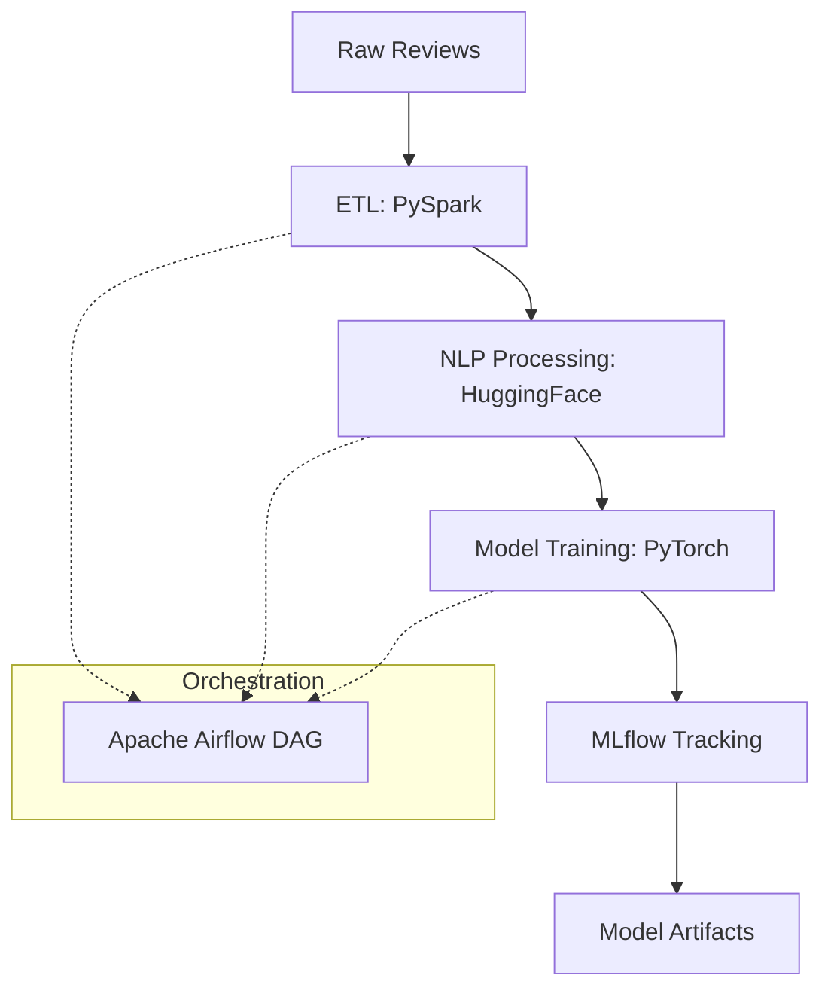

---

# 🚀 Sentiment Analysis ETL & ML Pipeline


---

## 📌 Executive Summary

This project delivers an **enterprise-grade, end-to-end ETL and Machine Learning pipeline** for **sentiment analysis of customer reviews**.

It automates the entire lifecycle—from raw data ingestion to model training, evaluation, and experiment tracking—using **distributed processing**, **modern NLP**, and **production-ready MLOps practices**.

The pipeline is designed to be:

* **Scalable** (PySpark, Docker)
* **Reliable** (Airflow orchestration)
* **Reproducible** (DVC, MLflow)
* **Production-ready** (CI/CD with GitHub Actions)

---

## 🧠 Business Problem

Organizations generate massive volumes of customer feedback through:

* Product reviews
* Surveys
* Support tickets
* Social platforms

However, this data is typically **unstructured, noisy, and siloed**, making it difficult to extract timely insights.

### Key Challenges

* Manual text analysis does not scale
* Inconsistent preprocessing impacts model quality
* Lack of reproducibility across experiments
* Poor visibility into pipeline health and model performance

### Business Impact

Without an automated pipeline, organizations face:

* Delayed customer sentiment insights
* Slower product and service improvements
* Reduced customer satisfaction and retention

---

## 💡 Solution Overview

This project solves these challenges by implementing a **fully automated ETL + ML pipeline** that:

1. Ingests raw customer review data
2. Cleans, preprocesses, and tokenizes text at scale
3. Trains and evaluates sentiment analysis models
4. Tracks experiments and artifacts centrally
5. Orchestrates workflows with monitoring and retries
6. Ensures reproducibility via CI/CD and data versioning

---

## 🏗️ High-Level Architecture



---

## 📸 Screenshots

### Airflow DAG – ETL & ML Orchestration


---

## ✨ Key Features

* **Automated ETL Pipeline**
  Distributed ingestion and preprocessing using PySpark

* **Advanced NLP Processing**
  Tokenization and embeddings via HuggingFace Transformers

* **Model Training & Evaluation**
  PyTorch-based sentiment classification pipeline

* **Experiment Tracking**
  MLflow for metrics, parameters, artifacts, and model versions

* **Workflow Orchestration**
  Apache Airflow DAG with task dependencies and monitoring

* **MLOps & Reproducibility**
  DVC for data/model versioning and Dockerized environments

* **CI/CD Automation**
  GitHub Actions for testing and pipeline validation

---

## 📂 Project Structure (Detailed)

```bash
sentiment-analysis/
├── artifacts/                  # Generated artifacts (models, metrics, logs)
│   ├── models/
│   ├── metrics/
│   └── logs/
│
├── dags/                       # Airflow DAG definitions
│   └── etl.py                  # ETL + ML pipeline DAG
│
├── data/                       # Datasets
│   ├── raw/                    # Raw customer reviews
│   └── processed/              # Cleaned & transformed data
│
├── docs/                       # Documentation assets
│   └── images/
│       └── mlflow_tracking.png
│
├── experiment/                 # Jupyter notebooks
│   ├── eda.ipynb               # Exploratory Data Analysis
│   └── prototyping.ipynb       # Model experimentation
│
├── src/                        # Core application code
│   ├── components/             # Modular pipeline components
│   │   ├── data_ingestion.py
│   │   ├── data_transformation.py
│   │   ├── model_trainer.py
│   │   └── model_evaluation.py
│   │
│   ├── pipeline/               # End-to-end pipeline logic
│   │   └── training_pipeline.py
│   │
│   └── utils/                  # Shared utilities
│       └── common.py
│
├── .github/
│   └── workflows/
│       └── ci.yml              # CI/CD pipeline
│
├── .dvc/                       # DVC configuration
├── dvc.yaml                    # DVC pipeline definition
├── Dockerfile                  # Docker image definition
├── docker-compose.yml          # Airflow + MLflow services
├── requirements.txt            # Python dependencies
├── setup.py                    # Package configuration
├── .gitignore
└── README.md
```

---

## 🔄 Pipeline Stages

### 1️⃣ Data Ingestion

* Reads raw customer reviews
* Performs schema validation
* Stores versioned datasets

### 2️⃣ Data Transformation

* Text cleaning and normalization
* Tokenization using Transformers
* Distributed execution with PySpark

### 3️⃣ Model Training

* PyTorch sentiment classifier
* Configurable hyperparameters
* Logged via MLflow

### 4️⃣ Model Evaluation

* Accuracy, precision, recall, F1
* Artifact persistence
* Model comparison

### 5️⃣ Orchestration

* Airflow DAG coordinates ETL + ML steps
* Failure handling and retries
* Centralized monitoring

---

## 🛠️ Tools & Technologies Used

* **Python 3.10+** — Core language
* **PySpark** — Distributed ETL processing
* **HuggingFace Transformers** — NLP models
* **PyTorch** — Deep learning framework
* **MLflow** — Experiment tracking & model registry
* **Apache Airflow** — Workflow orchestration
* **DVC** — Data & model version control
* **Docker & Docker Compose** — Reproducible environments
* **GitHub Actions** — CI/CD automation
* **Pandas & scikit-learn** — Data utilities & metrics
* **Jupyter Notebook** — EDA & prototyping

---

## ⚙️ Setup & Usage

### 1️⃣ Clone Repository

```bash
git clone https://github.com/your-org/sentiment-analysis-etl.git
cd sentiment-analysis-etl
```

### 2️⃣ Install Dependencies

```bash
python -m venv venv
source venv/bin/activate
pip install -r requirements.txt
```

### 3️⃣ Run Pipeline Locally

```bash
python src/pipeline/training_pipeline.py
```

### 4️⃣ Start Services (Airflow & MLflow)

```bash
docker-compose up -d
```

---

## 🔁 CI/CD Pipeline

GitHub Actions automatically:

* Runs unit tests
* Validates ETL and ML steps
* Ensures pipeline reproducibility
* Blocks faulty code from merging

---

## 📈 Business Impact

* ⏱️ **Faster insights** from customer feedback
* 📊 **Scalable sentiment analysis** for large datasets
* 🔁 **Reproducible ML workflows**
* 🚀 **Production-ready MLOps architecture**

---

## 🤝 Contributing

Contributions are welcome:

* Bug fixes
* Feature enhancements
* Documentation improvements

---

## 📄 License

MIT License

---
