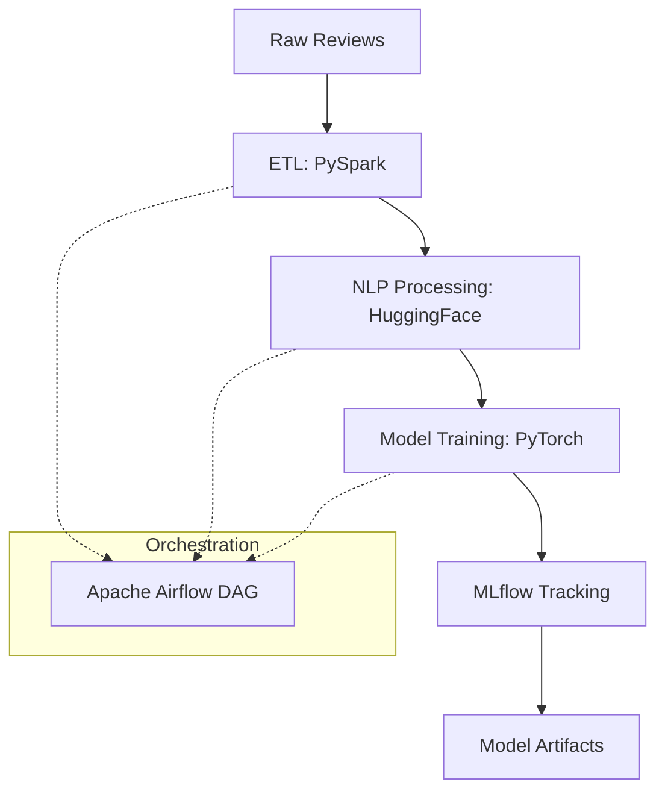

# 🚀 Sentiment Analysis ETL & ML Pipeline


---

## 📌 Executive Summary

This repository presents a robust, enterprise-grade, end-to-end ETL and Machine Learning pipeline for sentiment analysis of customer reviews. The solution is designed for scalability, reliability, and reproducibility, leveraging distributed processing, state-of-the-art NLP, and modern MLOps best practices.

**Key Attributes:**
- **Scalable**: Handles large datasets using PySpark and Dockerized deployments.
- **Reliable**: Automated orchestration with Apache Airflow ensures robust, monitored workflows.
- **Reproducible**: DVC and MLflow guarantee experiment and data reproducibility.
- **Production-Ready**: CI/CD with GitHub Actions, containerization, and modular codebase.

---

## 🧠 Business Problem

Organizations today receive massive volumes of customer feedback via:
- Product reviews
- Surveys
- Support tickets
- Social media and online platforms

This data is typically **unstructured, noisy, and siloed**, making it challenging to extract actionable insights in a timely manner.

### Key Challenges
- Manual text analysis is slow and unscalable.
- Inconsistent preprocessing degrades model quality.
- Lack of reproducibility across experiments.
- Poor visibility into pipeline health and model performance.

### Business Impact
Without automation, organizations face:
- Delayed sentiment insights and slow response to customer needs.
- Missed opportunities for product and service improvements.
- Reduced customer satisfaction and retention.

---

## 💡 Solution Overview

This project addresses these challenges by implementing a **fully automated ETL + ML pipeline** that:
1. Ingests raw customer review data from multiple sources.
2. Cleans, preprocesses, and tokenizes text at scale.
3. Trains and evaluates advanced sentiment analysis models.
4. Tracks experiments, metrics, and artifacts centrally.
5. Orchestrates workflows with monitoring, retries, and alerting.
6. Ensures reproducibility via CI/CD, data versioning, and containerization.

---

## 🏗️ High-Level Architecture



---

## 📸 Screenshots

### Airflow DAG – ETL & ML Orchestration


---

## ✨ Key Features

- **Automated ETL Pipeline**  
  Distributed ingestion and preprocessing using PySpark, supporting large-scale data.

- **Advanced NLP Processing**  
  Tokenization and embeddings via HuggingFace Transformers for high-quality text representation.

- **Model Training & Evaluation**  
  PyTorch-based sentiment classifier with configurable hyperparameters and robust evaluation metrics.

- **Experiment Tracking**  
  MLflow for logging metrics, parameters, artifacts, and model versions, enabling easy comparison and rollback.

- **Workflow Orchestration**  
  Apache Airflow DAG with clear task dependencies, monitoring, and failure handling.

- **MLOps & Reproducibility**  
  DVC for data/model versioning, Docker for environment consistency, and GitHub Actions for automated testing and deployment.

- **CI/CD Automation**  
  Automated unit tests, pipeline validation, and deployment checks with GitHub Actions.

- **Extensible & Modular**  
  Well-structured codebase with reusable components and utilities, supporting rapid experimentation and scaling.

---

## 📂 Project Structure (Detailed)

```bash
sentiment-analysis/
├── artifacts/                  # Generated artifacts (models, metrics, logs)
│   ├── models/
│   ├── metrics/
│   └── logs/
│
├── dags/                       # Airflow DAG definitions
│   └── etl.py                  # ETL + ML pipeline DAG
│
├── data/                       # Datasets
│   ├── raw/                    # Raw customer reviews
│   └── processed/              # Cleaned & transformed data
│
├── docs/                       # Documentation assets
│   └── images/
│       └── mlflow_tracking.png
│
├── experiment/                 # Jupyter notebooks
│   ├── eda.ipynb               # Exploratory Data Analysis
│   └── prototyping.ipynb       # Model experimentation
│
├── src/                        # Core application code
│   ├── components/             # Modular pipeline components
│   │   ├── data_ingestion.py
│   │   ├── data_transformation.py
│   │   ├── model_trainer.py
│   │   └── model_evaluation.py
│   │
│   ├── pipeline/               # End-to-end pipeline logic
│   │   └── training_pipeline.py
│   │
│   └── utils/                  # Shared utilities
│       └── common.py
│
├── .github/
│   └── workflows/
│       └── ci.yml              # CI/CD pipeline
│
├── .dvc/                       # DVC configuration
├── dvc.yaml                    # DVC pipeline definition
├── Dockerfile                  # Docker image definition
├── docker-compose.yml          # Airflow + MLflow services
├── requirements.txt            # Python dependencies
├── setup.py                    # Package configuration
├── .gitignore
└── README.md
```

---

## 🔄 Pipeline Stages

### 1️⃣ Data Ingestion
- Reads raw customer reviews from various sources (CSV, JSON, APIs).
- Performs schema validation and basic quality checks.
- Stores versioned datasets for traceability.

### 2️⃣ Data Transformation
- Cleans and normalizes text (removes noise, handles missing values).
- Tokenizes and encodes text using HuggingFace Transformers.
- Executes transformations in a distributed manner with PySpark.

### 3️⃣ Model Training
- Fine-tunes a BERT-based sentiment classifier using PyTorch.
- Supports hyperparameter tuning and early stopping.
- Logs all experiments and results to MLflow.

### 4️⃣ Model Evaluation
- Computes accuracy, precision, recall, F1, and confusion matrix.
- Persists evaluation artifacts and generates comparison reports.
- Supports model selection and promotion.

### 5️⃣ Orchestration
- Airflow DAG coordinates all ETL and ML steps.
- Handles task dependencies, retries, and alerting.
- Centralized monitoring and logging for all pipeline runs.

---

## 🛠️ Tools & Technologies Used

- **Python 3.10+** — Core language for all modules.
- **PySpark** — Distributed ETL and data processing.
- **HuggingFace Transformers** — State-of-the-art NLP models.
- **PyTorch** — Deep learning framework for model training.
- **MLflow** — Experiment tracking, model registry, and artifact management.
- **Apache Airflow** — Workflow orchestration and scheduling.
- **DVC (Data Version Control)** — Data and model versioning.
- **Docker & Docker Compose** — Containerization for reproducible environments.
- **GitHub Actions** — CI/CD automation for testing and deployment.
- **Pandas & scikit-learn** — Data manipulation and ML utilities.
- **Jupyter Notebook** — EDA and rapid prototyping.
- **Matplotlib / Seaborn** — Data visualization and reporting.

---

## ⚙️ Setup & Usage

### 1️⃣ Clone Repository

```bash
git clone https://github.com/your-org/sentiment-analysis-etl.git
cd sentiment-analysis-etl
```

### 2️⃣ Install Dependencies

```bash
python -m venv venv
source venv/bin/activate
pip install -r requirements.txt
```

### 3️⃣ Run Pipeline Locally

```bash
python training_pipeline.py
```

### 4️⃣ Start Services (Airflow & MLflow)

```bash
docker-compose up -d
```

### 5️⃣ Data & Model Versioning

```bash
dvc pull         # Retrieve latest data/model artifacts
dvc repro        # Reproduce pipeline stages
```

### 6️⃣ Experiment Tracking

- Access MLflow UI at `http://localhost:5000` to view experiments, metrics, and artifacts.

### 7️⃣ Airflow Monitoring

- Access Airflow UI at `http://localhost:8080` to monitor DAG runs and task status.

---

## 🔁 CI/CD Pipeline

GitHub Actions automatically:
- Runs unit and integration tests on every push.
- Validates ETL and ML pipeline steps.
- Ensures reproducibility and code quality.
- Blocks faulty code from merging into main.

---

## 📈 Business Impact

- ⏱️ **Faster, automated insights** from customer feedback.
- 📊 **Scalable sentiment analysis** for millions of reviews.
- 🔁 **Reproducible ML workflows** for audit and compliance.
- 🚀 **Production-ready MLOps architecture** for rapid deployment.

---

## 🤝 Contributing

We welcome contributions from the community!  
You can help by:
- Reporting bugs and issues.
- Suggesting new features or improvements.
- Submitting pull requests for code, documentation, or tests.

Please see [CONTRIBUTING.md](CONTRIBUTING.md) for guidelines.

---

## 📄 License

This project is licensed under the MIT License. See [LICENSE](LICENSE) for details.

---

## 📬 Contact

For questions, feedback, or collaboration opportunities, please open an issue or contact the maintainer.

---
```
